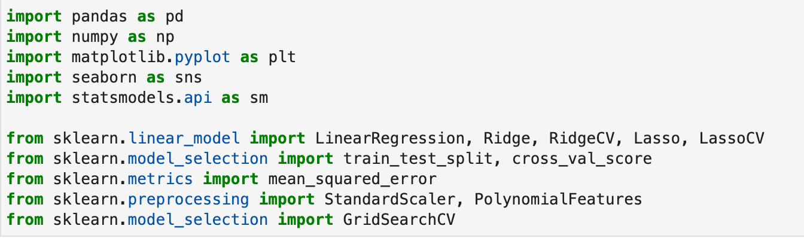
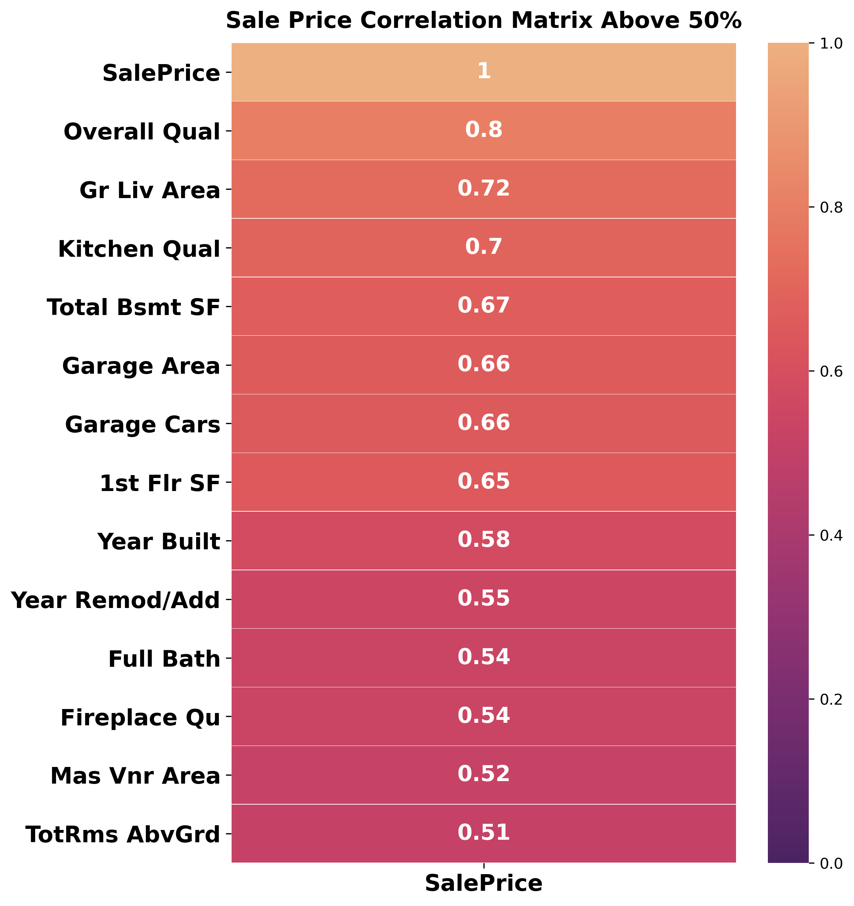
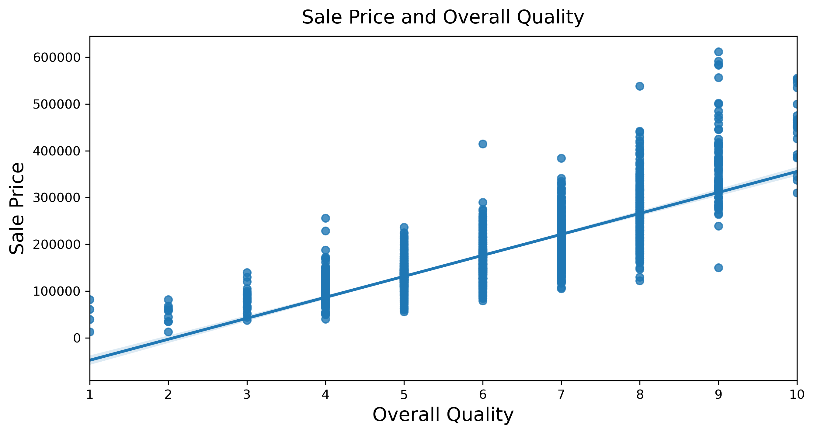
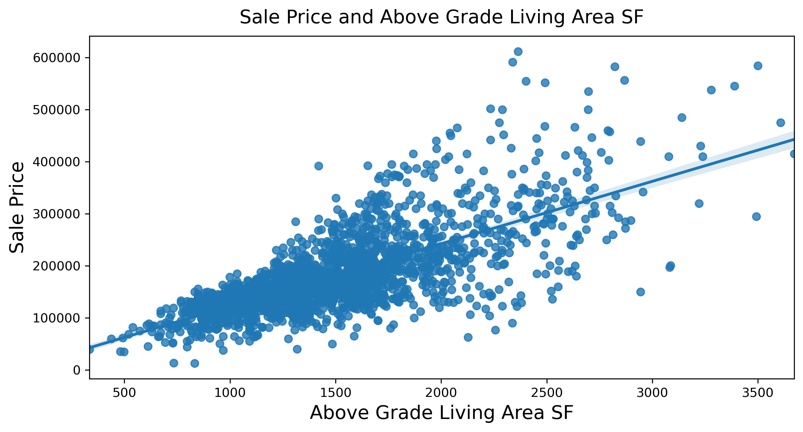
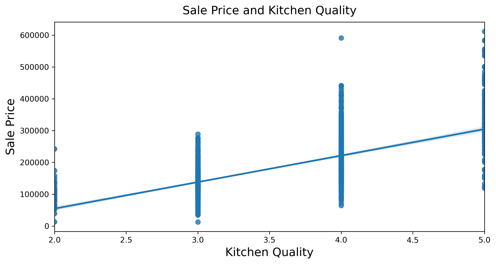
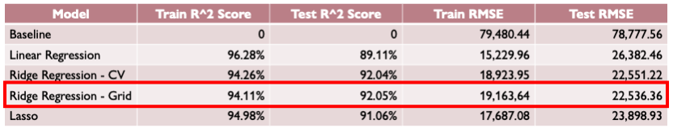
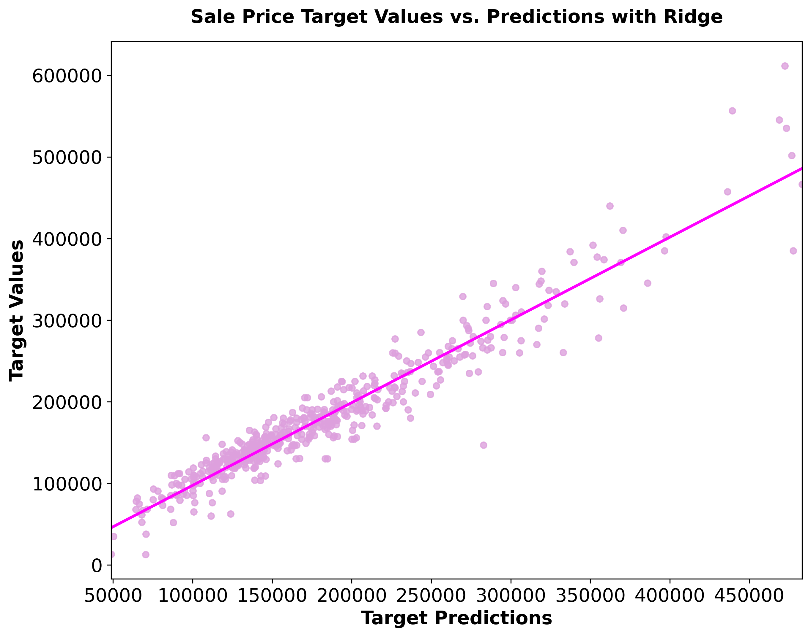
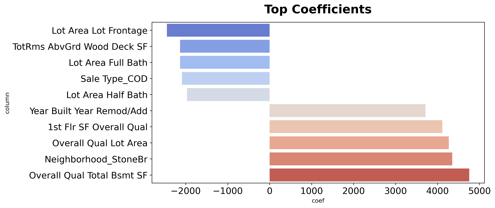

# Ames Housing Data Project
Jen Zieger

## Contents:
- [Background](#Background)
- [Problem Statement](#Problem-Statement)
- [Evaluation](#Evaluation)
- [Libraries](#Libraries)
- [Datasets](#Datasets)
- [Data Dictionary](#Data-Dictionary)
- [Modeling Process](#Modeling-Process)
- [Visualization](#Data-Visualization)
- [Evaluation](#Evaluation)
- [Conclusions and Recommendations](#Conclusions-and-Recommendations)

**Background**
Ames, Iowa is located about 30 miles north of Des Moines, Iowa, and is home to Iowa State University. According to the U.S. Census Bureau, the population in Ames in 2020 was 66,427. From 2015 to 2019, there were an estimated 25K+ households, and the owner-occupied housing unit rate was approximately 40.7%.([1](https://www.census.gov/quickfacts/amescityiowa)) 

**Problem Statement**  
As a new member of a residential real estate firm, I've been tasked with building a model that can be used in-house to determine what features and model best predict housing prices and potentially build out the model to sell to other companies across the country. For the beta version of the model, I will use a dataset containing assessed values for individual residential properties sold in Ames, IA, from 2006 to 2010.

**Evaluation**  
To build my model, I will use train-test split, cross-validation, and grid searching for hyperparameters, exploratory data analysis, and correlation analysis of independent features. I will be using different supervised learning regression techniques, including Linear, Ridge, and Lasso, to my model. I will be evaluating my model with R-squared score and Root Mean Squared Error.  

**Libraries**
 I used the following libraries in this project.

**Datasets**
 I used the following datasets for building and testing my model.

 [`train.csv`]('./datasets/train.csv'): Train Dataset
 [`test.csv`]('./datasets/test.csv): Test Dataset

- The train dataset has 2051 rows, representing individual houses in Ames and 81 columns representing housing features.
- The test dataset has 878 rows and 80 columns. 
- SalePrice is the one column that is in the train dataset and not in the test dataset. Thus, the difference in the number of columns. 
- The feature columns had a mix of continuous, discrete, and ordinal values. 

**Data Dictionary**
To view the data dictionary, please go to the following link. 

([data_dictionary](http://jse.amstat.org/v19n3/decock/DataDocumentation.txt))

**Modeling Process**

In order to build the best regression model possible, I followed the following steps. Of course, these steps are not linear, as I had to revisit some of them throughout the project. 

Data Cleaning and Exploratory Data Analysis (EDA)  
   - Replaced or Removed Null Values
   - Removed Columns or Rows as Needed
   - Summary Statistics 
   - Review of Distribution
   - Identified Outliers 
   - Correlation Matrices for Features and Sale Price
   - Scatterplot of Relationship for Features and Sale Price

Feature Engineering and Selection  
   - One-Hot Encoding
   - Ordinal Encoding 
   - Polynomial Features for Features That Were Not One-Hot Encoded
   - Ultimately, the Model Used 422 Features

Preprocessing 
   - Finalized Features 
   - Defined X and Y
   - Used Train Test Split to Split Train Dataset Into a Train Dataframe and Test Dataframe

Modeling 
   - Baseline 
   - Linear Regression 
   - Ridge Regression 
        - With Cross-Val Score
        - With GridsearchCV
   - Lasso Regression 

Evaluation  
   - R-Squared Score
   - Root Mean Squared Error 

**Visualization**

These are features had a correlation with Sale Price of 0.5 and higher.

These were the top three features in the correlation matrix. These charts show the positive linear relationship between Sale Price and these features. 

**Evaluation**

The Ridge Regression model with GridsearchCV was the best for my model. This model predicts 92% of the variance in the test set Sale Price compared to a model with no predictors. While the model could be off by potentially \\$22,536, it is over \$57,400 lower than the baseline model.

There is a positive linear relationship between the Target Values and Target Predictions of Sale Price with the Ridge Regression model. 

Top Positive Coefficients:  
For every 1 unit increase in Overall Quality and Total Basement Square Feet, I would expect there to be an increase in the value of a home by about \$4,750, all else being constant.

I would expect that the value of a house will increase by about \$4,350 if it is located in the neighborhood Stone Brook, all else being constant.

Top Negative Coefficients:  
For every 1 unit increase in Lot Area and Lot Frontage, I would expect there to be a decrease in the value of a home by about \$2,450, all else being constant.

For every 1 unit increase in Total Rooms Above Ground and Wood Deck Square Feet, I would expect there to be a decrease in the value of a home by about $2,130, all else being constant. 

**Conclusions and Recommendations**

The Ridge Regression model was the best model for predicting pricing and reducing error. The model predicted 92% of the testing housing sale prices with a 22,536 RMSE. 

Before putting this model to use, I would recommend the following in order to improve the model: 
- Try other models and regularization methods
- Reevaluate the features used 
- Gather more current data 
- Try using the model in other housing markets